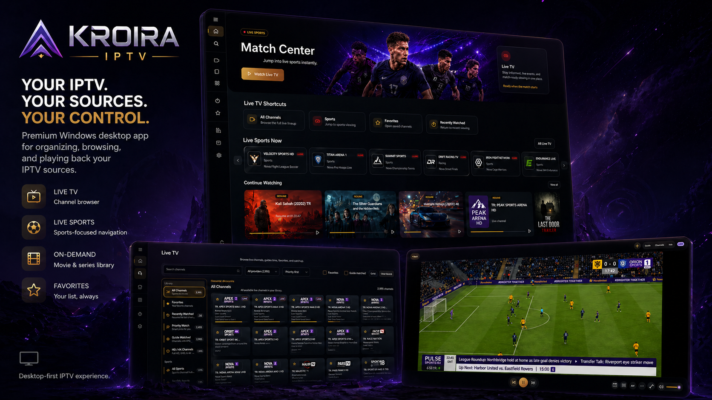

# KROIRA IPTV

Lightweight, desktop-first Windows IPTV player for user-provided legal M3U and Xtream-compatible sources.

[Get KROIRA IPTV from Microsoft Store](https://apps.microsoft.com/detail/9NFBFHT16FWZ?cid=github_readme)

[Website](https://kroira.com) | [Support](SUPPORT.md) | [Privacy](docs/privacy.html) | [Security](SECURITY.md) | [Contributing](CONTRIBUTING.md)

> KROIRA IPTV is only a software player and source manager. It does not provide channels, playlists, movies, series, live TV, sports, streams, subscriptions, credentials, or any media content. Users must bring their own legal M3U or Xtream-compatible source.

## What It Does

KROIRA IPTV is a packaged WinUI 3 / .NET 8 Windows app for people who already have authorized IPTV sources and want a local desktop player for organizing, browsing, diagnosing, and playing those sources.

Core features:

- M3U and Xtream-compatible source support
- Live TV, Movies, and Series organization
- EPG guide support for sources that provide guide data
- Favorites across supported media sections
- Continue Watching for resumable VOD playback
- Local profiles, settings, favorites, guide state, and watch state
- Source diagnostics for sync quality, guide coverage, logos, duplicates, probes, and playback readiness
- Cinematic embedded playback through `mpv/libmpv`
- Fullscreen playback, keyboard-friendly controls, audio tracks, subtitles, and picture-in-picture where available
- Lightweight Windows desktop experience built with WinUI 3, Windows App SDK, and .NET 8

## What It Does Not Provide

KROIRA is not an IPTV reseller, playlist index, stream host, subscription provider, credential broker, or content service.

KROIRA does not bypass DRM, paywalls, authentication, provider restrictions, or access controls. Source availability, legality, reliability, categories, logos, metadata, subtitles, audio tracks, and EPG coverage depend on the source the user adds.

## Install

### Recommended: Microsoft Store

Install the public Windows app from Microsoft Store:

- [KROIRA IPTV on Microsoft Store](https://apps.microsoft.com/detail/9NFBFHT16FWZ?cid=github_readme)
- Store ID: `9NFBFHT16FWZ`

### Developers: Build From Source

Clone this repository and build the packaged Windows app locally.

Requirements:

- Windows 10 version 1809 or newer, or Windows 11
- .NET SDK compatible with [global.json](global.json), currently .NET `8.0.400` with latest feature roll-forward
- Visual Studio 2022 or newer with Windows App SDK / WinUI workload support
- Windows App SDK runtime compatible with the project package references

## Screenshots

The repository screenshot set lives under [docs/screenshots/store](docs/screenshots/store/). These images use sanitized sample data and are safe for public repository and Store-review use.



| Screen | File |
| --- | --- |
| Home | [01-home.png](docs/screenshots/store/01-home.png) |
| Live TV | [02-live-tv.png](docs/screenshots/store/02-live-tv.png) |
| Movies | [03-movies.png](docs/screenshots/store/03-movies.png) |
| Series | [04-series.png](docs/screenshots/store/04-series.png) |
| Sources | [05-sources.png](docs/screenshots/store/05-sources.png) |
| EPG Center | [06-epg-center.png](docs/screenshots/store/06-epg-center.png) |
| Settings | [07-settings.png](docs/screenshots/store/07-settings.png) |
| Player | [08-player.png](docs/screenshots/store/08-player.png) |

Public screenshots must use sanitized or sample data that is authorized for public display. See the [Store Screenshot Workflow](docs/store_screenshot_workflow.md).

## Supported Source Types

| Source type | Input model | Guide behavior | Notes |
| --- | --- | --- | --- |
| M3U | Remote URL or local playlist file | Detected XMLTV, manual XMLTV override, fallback XMLTV URLs, or no guide | Categories, logos, and stream reliability depend on the playlist |
| Xtream-compatible | Server URL, username, and password | Provider-derived guide URL, manual XMLTV override, fallback XMLTV URLs, or no guide | Live, VOD, and series availability depend on the account/source |
| Supported provider portal profiles | Portal URL plus provider-specific profile details where supported | Manual XMLTV override, fallback XMLTV URLs, or no guide | Provider-dependent behavior; only use sources you are authorized to access |

## Development

### Run From Visual Studio

1. Open [Kroira.sln](Kroira.sln).
2. Select the packaged `Kroira.App` startup profile.
3. Build for `x64`.
4. Run or debug the packaged app from Visual Studio.

KROIRA expects package identity for normal app flows. Do not use `bin\...\Kroira.App.exe` as the primary smoke-test path.

### Build From PowerShell

```powershell
dotnet restore Kroira.sln
dotnet build Kroira.sln -c Debug -p:Platform=x64 -p:AppxPackageSigningEnabled=false
```

Launch the packaged debug build outside the IDE:

```powershell
powershell -ExecutionPolicy Bypass -File .\scripts\launch-packaged-debug.ps1
```

### Tests And Validation

Run unit tests:

```powershell
dotnet test Kroira.sln -c Debug -p:Platform=x64 -p:AppxPackageSigningEnabled=false
```

Run the deterministic regression corpus:

```powershell
powershell -ExecutionPolicy Bypass -File .\scripts\run-regressions.ps1
```

Run the CI-equivalent local validation:

```powershell
powershell -ExecutionPolicy Bypass -File .\scripts\ci-regressions.ps1 -Configuration Release
```

Run the full V2 release validation gate:

```powershell
powershell -NoProfile -ExecutionPolicy Bypass -File .\scripts\validate-v2-release.ps1 -Configuration Debug -Platform x64
```

Create an unsigned local review package:

```powershell
powershell -NoProfile -ExecutionPolicy Bypass -File .\scripts\package-v2-release.ps1 -Unsigned -SkipValidation -Configuration Release -Platform x64
```

Unsigned packages are for local review only and should not be uploaded to Partner Center.

### Screenshot QA

For local visual QA:

```powershell
powershell -NoProfile -ExecutionPolicy Bypass -File .\scripts\visual-smoke.ps1 -Configuration Debug -Platform x64
```

For Store/release screenshot review:

```powershell
powershell -NoProfile -ExecutionPolicy Bypass -File .\scripts\store-screenshots.ps1 -Configuration Release -Platform x64 -SanitizedDataConfirmed
```

## Repository Layout

- `src/Kroira.App/` - packaged WinUI 3 Windows app
- `src/Kroira.App/Services/Playback/` - embedded `mpv/libmpv` playback pipeline
- `src/Kroira.App/Services/Parsing/` - source and guide parsing pipeline
- `tests/Kroira.UnitTests/` - unit and service-level validation
- `tests/Kroira.Regressions/` - deterministic ingestion and playback-resolution regression corpus
- `scripts/` - build, validation, packaging, screenshot, and release helpers
- `docs/` - public support/privacy pages, Store submission copy, release checklist, and product docs
- `.github/` - issue templates, pull request template, and GitHub Actions workflows

## Project Status

KROIRA IPTV `2.0.0` is the current public app line. The Microsoft Store is the recommended install path for users, while this repository remains the source, issue, release, validation, and contributor workspace.

Useful project docs:

- [V2 Release Status](docs/v2_release_status.md)
- [Store Submission Info](docs/store_submission_info.md)
- [Store Release Checklist](docs/store_release_checklist.md)
- [Package Assets](docs/package_assets.md)
- [Release Notes v2.0.0](RELEASE_NOTES_v2.0.0.md)

Current focus areas:

- Playback stability, error messaging, and player UX polish
- Source diagnostics, repair guidance, and guide-quality improvements
- Search, filtering, sorting, and metadata-quality improvements across catalog surfaces
- Localization quality and provider-quirk coverage in the regression corpus

Release-gated workflows such as recording, download, restore, and media-library features may exist in the codebase, but they are not part of the default public `2.0.0` surface.

## Privacy, Support, And Legal

- Website: [kroira.com](https://kroira.com)
- Microsoft Store: [apps.microsoft.com/detail/9NFBFHT16FWZ](https://apps.microsoft.com/detail/9NFBFHT16FWZ?cid=github_readme)
- Privacy policy: [docs/privacy.html](docs/privacy.html)
- Public privacy URL: [sativagenetics.github.io/KroiraIPTV/privacy.html](https://sativagenetics.github.io/KroiraIPTV/privacy.html)
- Support: [SUPPORT.md](SUPPORT.md)
- Public support URL: [sativagenetics.github.io/KroiraIPTV/support.html](https://sativagenetics.github.io/KroiraIPTV/support.html)
- Security reporting: [SECURITY.md](SECURITY.md)
- Code of conduct: [CODE_OF_CONDUCT.md](CODE_OF_CONDUCT.md)

Users are responsible for adding only authorized sources and for complying with applicable provider terms and laws.

## License

This repository is licensed under the [MIT License](LICENSE).
